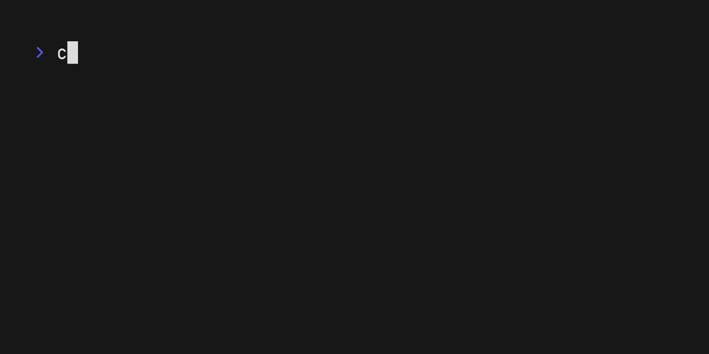

<p align="center">
  
</p>

# Envy
A simple CLI tool to manage environment variables for your project.


   <a href="https://vhs.charm.sh">
    
  </a>

## Overview
Envy is a simple CLI tool to safely store and recover `.env` files for projects. It's written in Go using the `cobra` cli tool and `lipgloss` for styling.
Envy uses an AES encryption to store your environment variables in a `.pack` file which you can unpack as you like. Envy also removes the .env file from the given folder and replaces it with a placeholder `.env-dist` file, once it's packed as it's generally not a good practice to push them onto repos.

## Installation

Head on over to the `Releases` page to pickout the release that best fits your requirements and add it to your computer's `bin` (`/usr/bin` or `/usr/local/bin`)

Or, you can also install it with go:
```sh
go install github.com/softmaxer/envy
```

## Usage
- Start a new envy vault by typing
  ```sh
  envy new
  ```
  This will start a new fault in your `$HOME` under the directory `.envy`.

- Once a vault is setup, headover to any git repo / project folder which contains an env file and type:
  ```sh
  envy pack
  ```
  This should encrypt your environment variables in your vault.
  The project name under which the file is encrypted will be the name of your current directory. If you want to change, that:
  ```sh
  envy pack <project-name>
  ```
  This will also remove the env file from the current directory to make sure your code is safe to be pushed onto a repositorty.
- to unpack, Just simply type:
  ```sh
  envy unpack
  ```
  Or with a project name:
  ```sh
  envy unpack <project-name>
  ```
